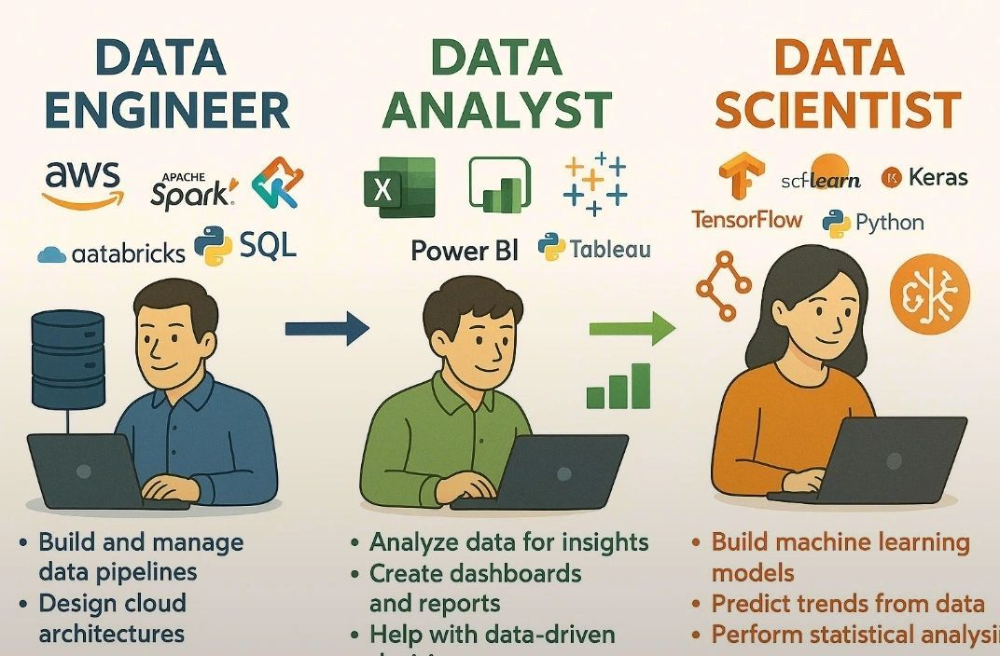

#  Day 11 — Data Jobs Explained (Beginner-Friendly)

Today we explore **the different jobs in the data world**.
As a future data analyst, it’s helpful to know **who does what** in a company that works with data.

#  Common Data Roles

### **1. Data Analyst**

* Works with data to **answer business questions**.
* Cleans, analyzes, and visualizes data.
* Tools: Excel, SQL, Python, Power BI, Tableau

**Example tasks:**

* Sales analysis
* Customer segmentation
* Monthly reporting

### **2. Data Scientist**

* Uses advanced techniques to **predict and model future outcomes**.
* Works with machine learning, statistics, and big data.
* Tools: Python, R, SQL, Spark

**Example tasks:**

* Predict customer churn
* Build recommendation systems
* Forecast sales

### **3. Data Engineer**

* Builds the **infrastructure and pipelines** for storing and processing data.
* Ensures data flows from source → storage → analysis.
* Tools: SQL, Python, Spark, Hadoop, cloud platforms

**Example tasks:**

* Automate data pipelines
* Manage databases
* Optimize large datasets

### **4. Business Intelligence (BI) Analyst**

* Focuses on **dashboards, reporting, and KPIs**.
* Translates data into insights for business leaders.
* Tools: Power BI, Tableau, Excel, SQL

**Example tasks:**

* Create interactive dashboards
* Monitor key business metrics
* Provide recommendations to management

### **5. Machine Learning Engineer**

* Builds and deploys **predictive models**.
* Works closely with data scientists.
* Tools: Python, TensorFlow, PyTorch, Scikit-Learn

**Example tasks:**

* Build recommendation engines
* Fraud detection models
* Predictive maintenance systems

### **6. Data/Analytics Consultant**

* Advises companies on **how to use data strategically**.
* Often works with multiple clients and industries.
* Tools vary by client: SQL, Excel, BI tools, Python

**Example tasks:**

* Design data-driven strategies
* Recommend reporting systems
* Improve decision-making with insights

#  How These Roles Work Together

* **Data engineers** provide clean data pipelines
* **Data analysts** explore and report insights
* **Data scientists** build models for predictions
* **BI analysts** visualize the insights for managers
* **ML engineers** deploy predictive systems
* **Consultants** advise companies on best practices

Together, they form the **data team** that powers modern companies.

#  Summary

| Role           | Main Task                     | Tools                            |
| -------------- | ----------------------------- | -------------------------------- |
| Data Analyst   | Analyze & visualize data      | Excel, SQL, Python, Power BI     |
| Data Scientist | Predict & model               | Python, R, ML tools              |
| Data Engineer  | Build pipelines & manage data | SQL, Python, Spark, Cloud        |
| BI Analyst     | Dashboards & reporting        | Power BI, Tableau, Excel         |
| ML Engineer    | Deploy ML models              | Python, TensorFlow, Scikit-Learn |
| Consultant     | Advise on data strategy       | Excel, SQL, BI, Python           |

## End of Day 11

**Day 12 →Introduction to Data Ethics & Privacy**

