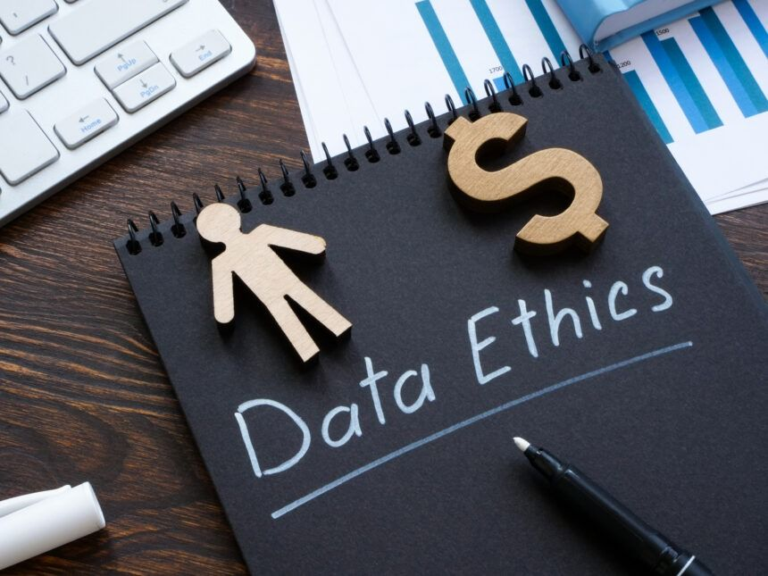

# **Day 12 → Introduction to Data Ethics & Privacy**

As data becomes more powerful, companies collect more information than ever before.
But with great power comes great responsibility.
That responsibility is called **Data Ethics** and **Data Privacy**.

These two topics are extremely important for anyone working with data — including data analysts.

---

##  **What Is Data Ethics?**

**Data Ethics** is about using data in a **fair, honest, and responsible** way.

It answers questions like:

* Is it right to collect this data?
* Should we use this data?
* Could this data harm someone?
* Are we treating people fairly?

Data ethics is about doing the **right thing**, not just the **legal thing**.

---

##  **What Is Data Privacy?**

**Data Privacy** is about protecting personal information and giving people control over their own data.

It focuses on:

* What data is collected
* How it is stored
* Who can access it
* How it is used
* Whether the person gave permission

Examples of personal data:

* Name
* Phone number
* Email
* Location
* Purchases
* Photos
* Medical data

Companies must protect this information.

---

##  Why Data Ethics & Privacy Matter

Bad handling of data can cause:

* Identity theft
* Leaks and hacks
* Financial loss
* Losing customer trust
* Legal trouble for the company
* Unfair decisions (for example: biased algorithms)

Good data ethics builds **trust**, **loyalty**, and **safety**.

---

##  Key Principles of Data Ethics

Here are the main rules every data professional should follow:

### **1️ Transparency**

Tell people what data you collect and why.

### **2️ Consent**

Collect data only if the user agrees.

### **3️ Fairness**

Avoid using data in ways that discriminate or harm.

### **4️ Security**

Protect the data from hackers and unauthorized access.

### **5️ Responsibility**

Think before using data.
Just because you *can* use data doesn’t mean you *should*.

---

##  Examples of Good vs Bad Data Ethics

###  **Good Ethics**

* Asking permission before collecting data
* Only collecting what is necessary
* Encrypting sensitive information
* Deleting data when no longer needed

###  **Bad Ethics**

* Tracking users secretly
* Selling user data without consent
* Storing data without protection
* Building biased AI systems

---

##  Data Privacy Laws (Simplified)

Many countries have strong laws that protect people's data:

* **GDPR** (Europe)
* **CCPA** (California)
* **HIPAA** (Health data in the US)

Even if you don’t live in these places, companies must follow them.

---

##  Why Analysts Should Care

As a data analyst, you will:

* Work with customer data
* Access private information
* Build dashboards and reports
* Share insights with teams

You must make sure data is used **ethically**, **fairly**, and **safely**.

Ethics is part of being a professional.

## End of Day 12

**Day 13 →Data Pipelines (How Data Moves Automatically)**
