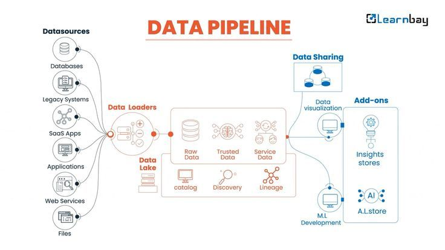

# **Day 13 → Data Pipelines (How Data Moves Automatically)**

In modern companies, data flows every second — from apps, websites, sensors, customers, payments, and more.
But this data doesn’t move by itself.

It needs a **data pipeline**.

A data pipeline is like a **factory conveyor belt** for data — it moves data from one place to another **automatically**, cleans it, and prepares it for analysis.

---

##  **What Is a Data Pipeline?**

A **data pipeline** is a system that:

1. **Collects** data
2. **Moves** data to storage
3. **Cleans and transforms** it
4. **Delivers** it to the right place (a dashboard, a database, etc.)

It’s the behind-the-scenes technology that ensures analysts always have **fresh, ready-to-use data**.

---

##  **How a Data Pipeline Works (Simple View)**

Here are the basic steps of a data pipeline:

### 1️ **Source → Where the data comes from**

Examples:

* Mobile apps
* Websites
* Databases
* APIs
* Sensors (IoT)
* CSV/Excel files

---

### 2️ **Ingestion → Collecting the data**

This step grabs the data from the source.

Tools used:

* APIs
* Kafka
* Airbyte
* ETL tools

---

### 3️ **Storage → Saving the data**

After collecting, the data is stored in:

* Databases
* Data warehouses (like BigQuery, Snowflake)
* Data lakes (huge storage for raw data)

---

### 4️ **Transformation → Cleaning & preparing**

This is where the data becomes useful.

Includes:

* Removing duplicates
* Fixing errors
* Converting formats
* Creating new calculated columns
* Joining multiple data sources

This step is also known as **ETL** or **ELT**:

* **E**xtract
* **T**ransform
* **L**oad

---

### 5️ **Destination → Where the data goes**

The final cleaned data is sent to:

* Dashboards
* BI tools (Power BI, Tableau)
* Databases
* Machine learning models
* Reports

---

##  **ETL vs ELT (Simple Explanation)**

### **ETL (Extract → Transform → Load)**

Transform data *before* loading it into storage.
Used when data warehouses are small.

### **ELT (Extract → Load → Transform)**

Load data first, then transform it inside the warehouse.
Used in modern systems (BigQuery, Snowflake).

---

##  Why Data Pipelines Matter

Data pipelines help companies:

* Move data **automatically**
* Clean data without manual work
* Refresh dashboards every day or hour
* Support machine learning systems
* Keep data accurate and reliable

Without pipelines, analysts waste hours manually cleaning and importing data.

Modern companies depend on them.

---

##  Real Examples of Data Pipelines

### **Netflix**

Collects viewing data → sends it to storage → cleans it → powers recommendation models.

### **Uber**

Tracks rides live → processes data in real time → updates prices and driver availability.

### **Amazon**

Collects product views → joins with purchase history → updates dashboards for managers.

---

##  Who Works With Data Pipelines?

* **Data engineers** build and maintain pipelines
* **Data analysts** use the final processed data
* **Data scientists** rely on pipeline data for models
* **BI teams** build dashboards on top of pipeline outputs

---

##  Summary

 **A data pipeline**:

* Automates data movement
* Cleans and prepares data
* Ensures data is always fresh
* Supports dashboards and analysis
* Powers modern data-driven companies

Understanding pipelines helps you think like a real data professional.

---

## End of Day 12

**Day 14 → What Is Machine Learning? (Beginner-Friendly)**

