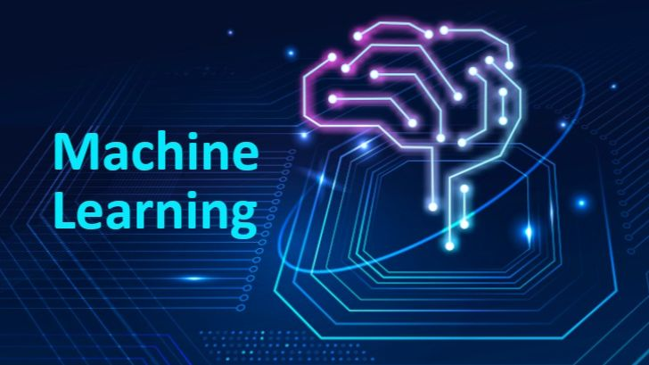

# **Day 14 → What Is Machine Learning? (Beginner-Friendly)**

Machine Learning (ML) is one of the most powerful parts of the data world.
It helps computers **learn from data** and make predictions or decisions **without being explicitly programmed**.

If you ever wondered how Netflix recommends movies or how TikTok shows the perfect videos — that’s machine learning.

---

##  **What Is Machine Learning? (Simple Definition)**

Machine Learning is when computers learn patterns from data and use those patterns to:

* Predict something
* Recommend something
* Classify something
* Detect something

Machine learning = **data + algorithms + learning**

If you give the computer enough examples, it can figure out the pattern by itself.

---

##  **Why Is It Called “Learning”?**

Because the machine improves over time.

Example:
You show a computer many pictures of cats and dogs.
After training, it can guess if a new picture is a cat or a dog.

It “learned” from examples — just like humans do.

---

##  **Three Main Types of Machine Learning**

### **1️ Supervised Learning (Most common)**

The machine learns from **labeled data** — meaning you tell it the correct answer during training.

Examples:

* Predict house prices
* Classify emails (spam or not spam)
* Predict whether a customer will cancel (churn)

It’s called “supervised” because you supervise it with answers.

---

### **2️ Unsupervised Learning**

The machine learns from **unlabeled data**, finding hidden patterns on its own.

Examples:

* Grouping customers by behavior
* Segmenting products
* Detecting unusual patterns (anomalies)

No answers are given — the machine discovers structure.

---

### **3️ Reinforcement Learning**

The machine learns by **trial and error**, just like a game.

Examples:

* Self-driving cars
* Robotics
* Game-playing AI (like AlphaGo)

It receives rewards or penalties and learns the best actions.

---

##  **Where Machine Learning Is Used in Real Life**

Machine learning powers almost everything today:

###  **Netflix**

Recommends movies based on what you watch.

###  **TikTok / Instagram**

Shows content you're most likely to like.

###  **Banks**

Detect fraudulent transactions.

###  **Amazon**

Recommends products and optimizes pricing.

###  **Games**

AI enemies adapt to your behavior.

###  **Self-driving cars**

Identify objects and make decisions.

Machine learning is everywhere.

---

##  **Tools Used in Machine Learning**

Beginners use:

* Python
* Pandas
* Scikit-learn

More advanced ML uses:

* TensorFlow
* PyTorch
* Keras
* Spark ML

But don’t worry — data analysts usually focus on the basic ML concepts first.

---

##  **Why Machine Learning Matters for Data Analysts**

Even if you don’t become a data scientist, understanding ML helps you:

* Work better with data science teams
* Read model outputs
* Explain predictions to business teams
* Understand how modern companies use data

ML is not required for entry-level data analyst jobs,
but knowing the basics gives you a **competitive advantage**.

---

##  **Summary**

| Concept                | Simple Meaning                        |
| ---------------------- | ------------------------------------- |
| Machine Learning       | Computers learning patterns from data |
| Supervised Learning    | Learning from labeled examples        |
| Unsupervised Learning  | Finding patterns without labels       |
| Reinforcement Learning | Learning by trial and reward          |
| Real-world uses        | Netflix, TikTok, Amazon, banks, cars  |

Machine learning is the brain behind many modern technologies — and a great topic to understand as you grow in your data journey.

---

## End of Day 14

**Day 15 → APIs & How Data Moves Between Apps**

