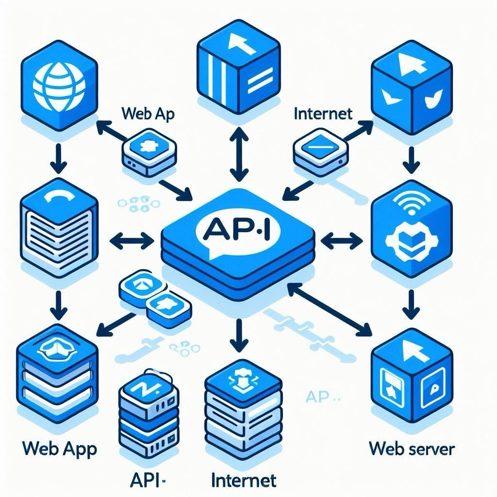

# **Day 15 → APIs & How Data Moves Between Apps**

Have you ever wondered how apps communicate with each other?

* How your weather app gets live weather data
* How Instagram loads your profile
* How websites show live football scores
* How maps update traffic in real time

The answer is: **APIs**.



APIs are the **language** apps use to talk to each other and exchange data.

Let’s break it down simply.


##  **What Is an API? (Simple Definition)**

**API = Application Programming Interface**

An API is a **bridge** that allows one app or system to get data from another system.

Think of it like:

* A waiter in a restaurant
* You (the user) give your request
* The waiter takes it to the kitchen
* The kitchen prepares the food
* The waiter brings the result back to you

The waiter = **API**

APIs deliver data from one place to another.


##  **How APIs Work (Simple Explanation)**

1. You send a request → “Give me the weather for today”
2. The API understands the request
3. The API goes to the server
4. The server finds the correct data
5. The API returns the data to you

APIs always return data in a structured format such as **JSON**.


## 🌤 Real Examples of APIs You Use Every Day

### **1️ Weather apps**

They call weather APIs to get temperature, humidity, and forecasts.

### **2️ Google Maps**

Gets real-time traffic, routes, and distances through APIs.

### **3️ Instagram / TikTok**

Your feed loads using internal APIs behind the scenes.

### **4️ Payment systems**

When you pay with Visa, the app uses payment APIs to verify your card.

### **5️ Football apps**

Match results, player stats, and live scores come through APIs.

APIs keep information fresh and connected.


##  **Why APIs Matter in Data**

APIs allow data analysts to:

* Pull live data from servers
* Import data automatically
* Connect dashboards to data sources
* Build automated workflows
* Analyze external data (weather, finance, sports, marketing, etc.)

APIs are the key to **real-time data analysis**.


## 🛠 Common API Tools & Concepts

### **1️ JSON**

The most common format APIs return:

```json
{
  "temperature": 29,
  "city": "Mogadishu",
  "forecast": "sunny"
}
```

### **2️ Endpoints**

The URL you ask for data from.

Example:
`api.weather.com/today`

### **3️ Requests**

Your message to the API.
Example: “Give me weather for city X.”

### **4️ Rate limits**

APIs limit how many requests you can make per minute/hour.


##  How Data Analysts Use APIs

Examples:

* Getting stock market prices
* Pulling football match stats
* Downloading cryptocurrency trends
* Getting marketing data (Facebook Ads, Google Analytics)
* Collecting weather data for forecasting
* Importing government open-data sets

APIs give analysts **fresh, live, up-to-date** information.


##  Real Company Use Cases

### **Uber**

Uses APIs for maps, payments, and driver locations.

### **Spotify**

Uses APIs to recommend music and sync playlists.

### **Airbnb**

Uses APIs to check availability, prices, and reviews in real time.

APIs make everything run smoothly behind the scenes.


##  Summary

| Concept         | Meaning                            |
| --------------- | ---------------------------------- |
| API             | A bridge for apps to exchange data |
| JSON            | The format APIs return data in     |
| Endpoint        | The URL where you request data     |
| Real uses       | Weather, maps, payments, apps      |
| Analyst benefit | Live, automated data collection    |

APIs are the backbone of modern data movement — and understanding them is a key skill for any future data analyst.


## End of Day 15

**Day 16 → Data Quality (Accuracy, Completeness, Consistency)**


