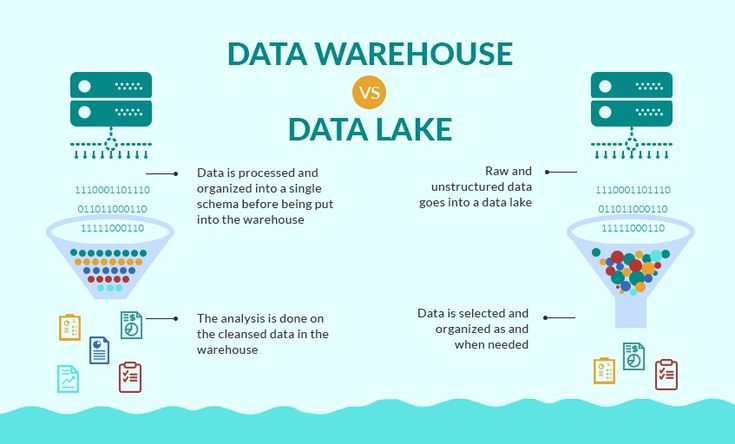

# ** Day 19 — Data Lakes vs Data Warehouses (Beginner-Friendly Guide)**

Understanding these two concepts is *super important* because almost every large company uses one (or both!) to store their data. They sound similar, but they work very differently.

## ** 1. What Are We Even Talking About?**

Before we compare them, let’s define them in simple words:

### ** Data Warehouse**

A **data warehouse** is a large, organized storage system designed for **clean, structured data**.
Companies use it after the data has been processed and made neat.

 Imagine a **library** where every book is organized into categories and shelves.

**Used for:**

* Business reports
* Dashboards (Power BI / Tableau)
* Historical analysis
* Making decisions based on clean, trusted data

### ** Data Lake**

A **data lake** stores **huge amounts of raw data**, in any format.
Nothing is cleaned first — it’s stored “as is”.

 Imagine a **big ocean** where all types of water flow in: clean, salty, muddy, rainwater… everything.

**Used for:**

* Machine Learning
* Big Data
* Real-time streaming data
* Experiments by data scientists

## ** 2. Key Differences (Easy Comparison)**

Here’s a clear table to help you see the difference:

| Feature          | Data Lake                                  | Data Warehouse                      |
| ---------------- | ------------------------------------------ | ----------------------------------- |
| **Type of Data** | Raw, unprocessed                           | Clean, processed                    |
| **Formats**      | Anything (images, logs, JSON, audio, text) | Structured tables (rows/columns)    |
| **Users**        | Data scientists, ML engineers              | Analysts, BI teams, company leaders |
| **Purpose**      | Exploration, ML, big data                  | Reporting, business decisions       |
| **Speed**        | Fast to store, slow to query               | Slow to store, fast to query        |
| **Cost**         | Cheaper (cloud storage)                    | More expensive                      |
| **Structure**    | No rules                                   | Highly organized                    |

## ** 3. When Should a Company Use a Warehouse?**

A company uses a **data warehouse** when they need:
✔ Clean, reliable data
✔ Reporting dashboards (Power BI)
✔ Finance, sales, HR reports
✔ Data consistency

Example:

* A retail store creating monthly sales dashboards.
* A bank summarizing customer transactions weekly.

## ** 4. When Should a Company Use a Data Lake?**

A company uses a **data lake** when they work with:
✔ Machine learning
✔ Big streaming data (IoT sensors, app logs)
✔ Raw data from many sources
✔ Data experiments

Example:

* Netflix storing all viewing logs (millions per second).
* TikTok storing raw video metadata + user activity for ML.

## ** 5. Modern Companies Use BOTH**

Today, most tech companies use a **data lake → data warehouse** pipeline:

1️.Data enters the **lake first** (raw)
2️.Engineers clean, transform it
3️.The clean data moves into the **warehouse**
4️.Analysts use it for dashboards

This is called a **Lakehouse Architecture** (Databricks, Snowflake).

## ** 6. Simple Analogy to Remember**

* **Data Lake = Everything goes in. Messy. Big. Cheap.**
* **Data Warehouse = Only clean, organized data stays. For business.**

Think of it like cooking:

* A **data lake** is the *market* — raw ingredients everywhere.
* A **data warehouse** is the *kitchen* — only prepared, clean ingredients ready for cooking.

## ** 7. Why This Matters for You (As a Future Analyst)**

As you continue your learning path:

* In Excel & Power BI → You're working with **warehouse-style** data
* In Python & ML → You'll often work with **lake-style** data

Understanding the difference helps you know **where your data comes from**.

## ** Summary (Very Short)**

* **Data Lake:** raw, huge, messy, for ML
* **Data Warehouse:** clean, structured, for dashboards
* Companies often use **both** together

## End of Day 19

**Day 20 → ETL vs ELT ** 