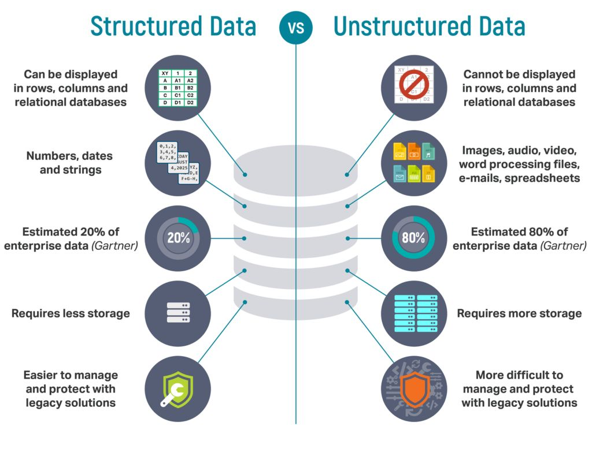

# **Day 21 → Structured vs Unstructured Data**

In the world of data, not all information looks the same.
Some data is neatly organized like a spreadsheet.
Other data is messy, random, and impossible to fit into tables.

This leads to **two main types of data used in analytics**:

1. **Structured Data**
2. **Unstructured Data**

Understanding these two helps analysts choose the right tools, databases, and processing methods.

Let’s break them down with clear examples.

#  **1. Structured Data (Organized & Easy to Analyze)**

**Structured data** is highly organized and fits perfectly into **rows and columns** — like an Excel sheet or a SQL database.

It is predictable, labeled, and easy to search.

###  Features of Structured Data

* Stored in tables
* Each column has a fixed format
* Easy to query using SQL
* Highly organized
* Perfect for dashboards and business reporting

###  Examples of Structured Data

* Sales tables
* Customer lists
* Order history
* Employee records
* Bank transactions
* Inventory data

Example table:

| Order_ID | Customer | Product | Price | Date       |
| -------- | -------- | ------- | ----- | ---------- |
| 1001     | Ali      | Phone   | 299   | 2025-01-10 |
| 1002     | Maryan   | Laptop  | 850   | 2025-01-12 |

This is **structured** because the format is always the same.

###  Where Structured Data Is Stored

* SQL databases
* Excel
* Google Sheets
* Data warehouses (BigQuery, Snowflake, Redshift)

###  Pros of Structured Data

* Easy to search
* Easy to analyze
* Works well with BI tools (Power BI, Tableau)
* Clean and reliable

###  Cons

* Limited flexibility
* Cannot store things like images or text paragraphs easily
* Needs a predefined structure

#  **2. Unstructured Data (Messy, Complex, and Rich)**

**Unstructured data** does *not* fit into tables.
It has no fixed format and is harder for machines to interpret.

This type of data is growing the fastest — especially in social media, videos, and customer behavior logs.

###  Features of Unstructured Data

* No rows/columns
* No fixed structure
* Harder to search
* Requires AI/ML for analysis

###  Examples of Unstructured Data

* Images
* Videos
* Audio recordings
* Social media posts
* Emails
* Chats and messages
* PDFs
* Word documents
* Web pages

Example of unstructured data (a tweet):

> “I love the new iPhone! Amazing camera but battery life is bad ”

This does NOT fit cleanly into rows & columns.

###  Where Unstructured Data Is Stored

* Data lakes
* Cloud storage (S3, Azure Blob, Google Cloud Storage)
* NoSQL databases (MongoDB, Elasticsearch)

###  Pros of Unstructured Data

* Very flexible
* Contains rich information
* Useful for AI and machine learning
* Represents real human behavior

###  Cons

* Hard to clean
* Hard to process
* Requires advanced tools to analyze

#  **Structured vs Unstructured → Key Differences**

| Feature     | Structured Data           | Unstructured Data    |
| ----------- | ------------------------- | -------------------- |
| Format      | Fixed (rows/columns)      | No fixed format      |
| Storage     | SQL databases, warehouses | Data lakes, NoSQL    |
| Analysis    | Easy with SQL             | Harder, needs NLP/AI |
| Examples    | Sales tables              | Videos, text, images |
| Speed       | Fast to query             | Slower to process    |
| Flexibility | Low                       | Very high            |

Both types are important — they serve different business needs.

#  **Real-World Examples**

### **1. Netflix**

* **Structured:** List of users, login times, plans
* **Unstructured:** Movie scenes, subtitles, thumbnails

Netflix uses both to power recommendations.

### **2. TikTok**

* **Structured:** User profile, follow counts, watch duration
* **Unstructured:** Videos, comments, music audio

Unstructured video data is analyzed using AI to identify trends.

### **3. Banks**

* **Structured:** Transactions, account balances
* **Unstructured:** Phone call recordings, scanned documents

Banks analyze call recordings to improve service.

### **4. Amazon**

* **Structured:** Purchases, prices, shipping times
* **Unstructured:** Reviews, product images, Q&A text

AI reads millions of reviews to spot issues.

#  Tools Used for Each Type

### **Structured Data Tools**

* SQL
* Excel
* Power BI
* Tableau
* Data warehouses

### **Unstructured Data Tools**

* Python NLP (spaCy, NLTK, transformers)
* Computer vision (OpenCV)
* Data lakes
* Hadoop / Spark
* NoSQL databases

#  **Why This Matters for Data Analysts**

You will work with both types:

 Structured → Dashboards, reports, KPIs
 Unstructured → Text analytics, sentiment analysis, basic machine learning

Understanding the difference helps you choose the right:

* Storage
* Tools
* Processing methods
* Data cleaning approach

It is a fundamental concept in any data career.

#  **Summary**

**Structured Data**

* Organized
* Easy to analyze
* SQL-ready
* Found in tables

**Unstructured Data**

* Messy
* Powerful
* Harder to process
* Includes text, images, videos

Both power modern analytics — and both skills will make you a stronger data professional.

## End of Day 21

 **Day 22 → Semi-Structured Data (JSON, XML, Logs)**

