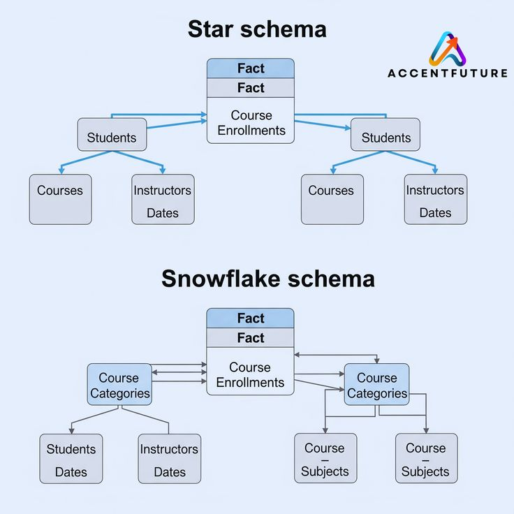

# **Day 24 → Star Schema vs Snowflake Schema (Data Modeling Explained)**

When companies store data for analysis and dashboards, **how the data is structured matters a lot**.
Two of the most common data warehouse designs are:

* **Star Schema**
* **Snowflake Schema**

Both are used in **data modeling**, especially for analytics and business intelligence.

Today, we’ll understand **what they are, how they work, and when to use each one**.

##  **What Is a Schema in Data Modeling?**

A **schema** is the **structure of data** inside a database or data warehouse.

It defines:

* How tables are organized
* How tables are connected
* How data is stored and queried

Good schema design = **faster queries + easier analysis**.

##  **Star Schema**

###  What Is a Star Schema?

A **Star Schema** has:

* **One central fact table**
* **Multiple dimension tables**
* The layout looks like a  star

The **fact table** is in the center, and **dimension tables** connect directly to it.

###  Structure of Star Schema

#### **Fact Table**

Contains:

* Numerical measurements (metrics)
* Foreign keys to dimensions

Examples:

* Sales amount
* Quantity sold
* Revenue
* Profit

#### **Dimension Tables**

Contain descriptive information.

Examples:

* Date
* Product
* Customer
* Location
* Store

###  Example: Sales Star Schema

**Fact_Sales**

* Date_ID
* Product_ID
* Customer_ID
* Sales_Amount
* Quantity

**Dim_Date**

* Date_ID
* Day
* Month
* Year

**Dim_Product**

* Product_ID
* Product_Name
* Category

**Dim_Customer**

* Customer_ID
* Name
* City

All dimension tables connect **directly** to the fact table.

###  Advantages of Star Schema

* Simple and easy to understand
* Faster query performance
* Fewer joins
* Perfect for dashboards and BI tools
* Easy for beginners and analysts

###  Disadvantages of Star Schema

* Some data duplication in dimension tables
* Uses more storage space
* Less normalized

---

##  **Snowflake Schema**

###  What Is a Snowflake Schema?

A **Snowflake Schema** is a more **complex version** of Star Schema.

* Dimension tables are **normalized**
* Dimensions are split into **multiple related tables**
* The shape looks like a snowflake

###  Structure of Snowflake Schema

Instead of one large dimension table, data is broken into smaller tables.

Example:

**Dim_Product**

* Product_ID
* Product_Name
* Category_ID

**Dim_Category**

* Category_ID
* Category_Name

**Dim_Category_Type**

* Type_ID
* Type_Name

So:
  Fact table → Product → Category → Category Type

###  Advantages of Snowflake Schema

* Reduced data duplication
* Better storage efficiency
* More normalized design
* Better for very large dimensions

###  Disadvantages of Snowflake Schema

* More complex structure
* Slower queries (more joins)
* Harder to understand
* Not beginner-friendly
* BI tools may need optimization

---

##  **Star Schema vs Snowflake Schema (Comparison Table)**

| Feature             | Star Schema    | Snowflake Schema  |
| ------------------- | --------------- | ------------------- |
| Complexity          | Simple          | Complex             |
| Number of tables    | Fewer           | More                |
| Query speed         | Faster          | Slower              |
| Storage             | Uses more space | Uses less space     |
| Joins               | Few joins       | Many joins          |
| Ease of use         | Very easy       | Harder              |
| BI tool performance | Excellent       | Moderate            |
| Normalization       | Low             | High                |

##  **Which One Should You Use?**

### Use **Star Schema** when:

* Building dashboards
* Working with Power BI / Tableau
* Query performance is important
* Users are analysts or business users
* Simplicity is a priority

  **Most BI systems use Star Schema**

---

### Use **Snowflake Schema** when:

* Dimensions are very large
* Storage optimization matters
* Data is highly structured
* You need strong normalization

##  Real-World Usage

* **Power BI dashboards** → Star Schema
* **Enterprise data warehouses** → Often Snowflake Schema
* **Beginner projects** → Star Schema
* **Large corporate systems** → Mixed approach

Most companies start with **Star Schema** and only snowflake when needed.

##  Key Takeaways

* Both schemas organize analytical data
* **Star Schema = simplicity & speed**
* **Snowflake Schema = efficiency & normalization**
* Analysts usually prefer **Star Schema**
* Data engineers decide based on scale and performance

Understanding these schemas helps you:

* Design better dashboards
* Write faster SQL queries
* Think like a professional data analyst

## End of Day 20

 **Day 25 → How Dashboards Are Built End-to-End**
