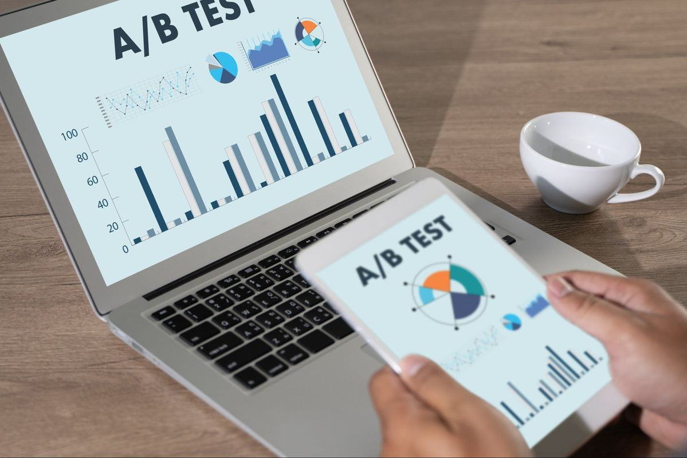

# **Day 28 → A/B Testing & Experimentation (Beginner to Intermediate)**

Data is not only about *analyzing what already happened*.
Modern companies also use data to **test ideas before making big decisions**.

That process is called **A/B Testing**.

A/B testing helps companies answer one simple but powerful question:

> **“Which option works better?”**

##  What Is A/B Testing?

**A/B Testing** is a controlled experiment where you compare **two versions** of something:

* Version **A** → the original (control)
* Version **B** → the changed version (variation)

You show each version to different users and **measure which performs better**.

Performance is measured using **metrics (KPIs)**.

##  Why A/B Testing Is Important

Without testing:

* Decisions are based on opinions
* Changes may hurt performance
* Companies take big risks

With A/B testing:

* Decisions are data-driven
* Risk is reduced
* Improvements are measurable
* Results are objective, not emotional

A/B testing turns **guessing into knowing**.

##  What Can Be A/B Tested?

Almost anything that users interact with:

###  Websites

* Button color (blue vs green)
* Page layout
* Headline text
* Images
* Call-to-action text

###  Apps

* App design
* Notification text
* Feature placement
* User onboarding flow

###  Marketing

* Email subject lines
* Email content
* Send time
* Ad creatives

###  Products

* Pricing
* Discounts
* Checkout flow
* Product descriptions

##  How A/B Testing Works (Step-by-Step)

### **1️. Define the Goal**

What do you want to improve?

Examples:

* Increase click rate
* Increase sales
* Reduce bounce rate
* Increase sign-ups

This goal becomes your **primary metric**.

### **2️. Create Two Versions**

* **Version A (Control)** → Original version
* **Version B (Variant)** → One change only

  Important rule:
  Change **only one thing at a time**, otherwise you won’t know what caused the result.

### **3️. Split the Users**

Users are randomly divided:

* 50% see Version A
* 50% see Version B

Randomization ensures fairness.

### **4️. Collect Data**

Track metrics such as:

* Click-through rate
* Conversion rate
* Time spent
* Revenue

Data is collected over time.

### **5️. Analyze the Results**

Compare results between A and B.

Example:

* Version A → 5% conversion
* Version B → 7% conversion

Version B performs better.

### **6️. Make a Decision**

* If B wins → apply the change
* If no difference → keep A
* If A wins → reject the change

##  Key Metrics Used in A/B Testing

Common KPIs include:

* Conversion Rate
* Click-Through Rate (CTR)
* Revenue per user
* Bounce Rate
* Retention Rate
* Engagement Time

The chosen metric must align with the business goal.

##  Statistical Significance (Simple Explanation)

Not every difference is meaningful.

**Statistical significance** answers:

> “Is this result real, or just random?”

A result is significant when:

* Enough users were tested
* The difference is large enough
* The confidence level is high (often 95%)

This prevents wrong decisions.

##  Real-World Examples

### **Netflix**

Tests:

* Thumbnails
* Titles
* Recommendations
* UI layouts

Small changes = millions in revenue.

### **Amazon**

Tests:

* Button placement
* Product recommendations
* Checkout flow

Even a 1% improvement matters at scale.

### **Google**

Tests:

* Search results layout
* Ad placements
* Page speed improvements

Google runs **thousands of experiments daily**.

##  Role of Data Analysts in A/B Testing

As a data analyst, you may:

* Design experiments
* Define success metrics
* Analyze results
* Check statistical significance
* Visualize outcomes
* Explain results to business teams

A/B testing is one of the **most valuable real-world skills** for analysts.

##  Common A/B Testing Mistakes

  Testing too short
  Small sample size
  Testing multiple changes at once
  Ignoring statistical significance
  Choosing the wrong metric

Good testing requires patience and discipline.

##  Tools Used for A/B Testing

* Google Optimize (now sunset, alternatives exist)
* Optimizely
* VWO
* Firebase
* Python (SciPy, Statsmodels)
* SQL + dashboards
* Excel (basic tests)

##  Summary Table

| Concept      | Meaning                |
| ------------ | ---------------------- |
| A/B Test     | Comparing two versions |
| Control      | Original version       |
| Variant      | Modified version       |
| Metric       | What you measure       |
| Significance | Confidence in results  |
| Goal         | Improve performance    |

##  Final Thought

A/B testing is the **scientific method of business**.

Instead of asking:

> “What do we think users want?”

Companies ask:

> **“What does the data prove?”**

Mastering A/B testing makes you a **strong, practical, business-ready data analyst**.

##  End of Day 28

**Day 29 → Data Analytics Project Workflow (End-to-End)**

