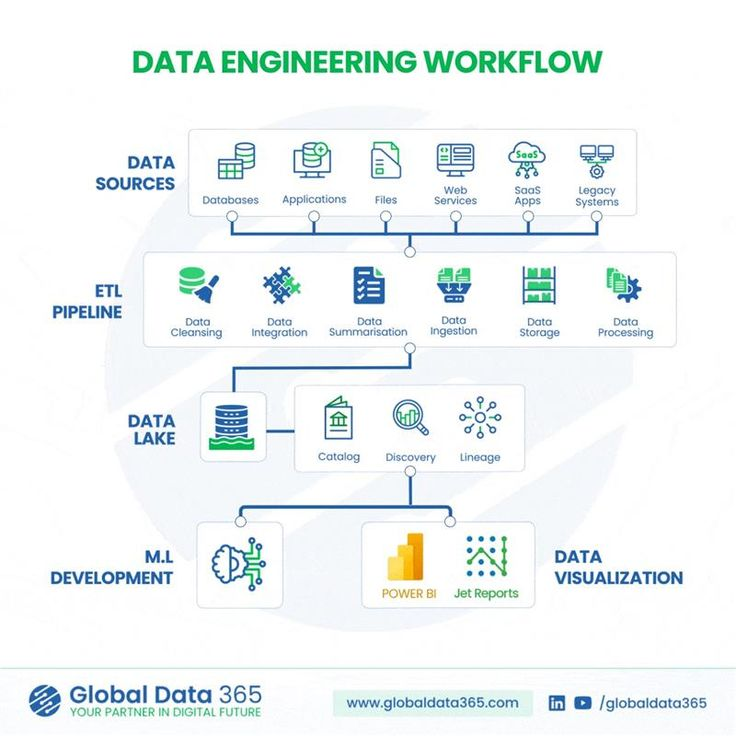

# **Day 29 → Data Analytics Project Workflow (End-to-End)**

A data analytics project is not just about opening Excel or writing SQL queries.
It follows a **clear workflow** — a series of steps that turn **raw data into real business decisions**.

Today, we’ll walk through the **entire data analytics project lifecycle**, from start to finish, exactly how professionals do it.

##  What Is a Data Analytics Project Workflow?

A **data analytics project workflow** is the structured process analysts follow to:

* Understand a problem
* Collect the right data
* Clean and analyze it
* Create insights
* Communicate results
* Support decision-making

Without a workflow, analysis becomes random and unreliable.

## 🧩 The 8 Main Stages of a Data Analytics Project

### **1️. Business Understanding (The Most Important Step)**

Everything starts with a **business question**, not data.

Examples:

* Why are sales dropping?
* Which products are most profitable?
* Why are customers leaving?
* How can we reduce costs?

Key tasks:

* Talk to stakeholders
* Define goals
* Understand success metrics
* Clarify constraints

  **Bad question:** “Analyze sales data”
  **Good question:** “Why did Q3 sales drop by 15% in Region A?”

---

### **2️. Data Requirements & Planning**

Now you decide **what data is needed**.

Questions to ask:

* What data sources do we need?
* Do we have access?
* What time period?
* What level of detail?

Common data sources:

* Databases (SQL)
* APIs
* Excel/CSV files
* CRM systems
* Web analytics tools

Good planning saves a lot of time later.

### **3️. Data Collection**

This step is about **getting the data**.

Methods include:

* SQL queries
* API calls
* Exporting files
* Automated pipelines

At this stage, data is usually:

* Messy
* Incomplete
* Inconsistent
* Not ready for analysis

That’s normal.

### **4️. Data Cleaning & Preparation**

This is where analysts spend **60–80% of their time**.

Cleaning tasks include:

* Removing duplicates
* Fixing missing values
* Correcting data types
* Standardizing formats
* Removing outliers
* Validating accuracy

Tools used:

* Excel
* SQL
* Python (Pandas)

  **Rule:** Bad data = bad insights

### **5️. Exploratory Data Analysis (EDA)**

EDA helps you **understand what the data is telling you**.

Common activities:

* Summary statistics
* Grouping and aggregation
* Trend analysis
* Correlation analysis
* Initial charts and graphs

Questions answered:

* What patterns exist?
* What looks unusual?
* What relationships appear?

EDA guides the next steps.

### **6️. Analysis & Insight Generation**

Now you answer the **original business questions**.

This may include:

* KPI calculations
* Comparisons (month vs month)
* Segmentation
* Funnel analysis
* Cohort analysis
* Hypothesis testing

The goal:
  Turn data into **clear insights**, not just numbers.

Example insight:

> “Customers acquired through social media spend 25% more than email customers.”

### **7️. Data Visualization & Reporting**

Insights must be **communicated clearly**.

This is done using:

* Dashboards (Power BI, Tableau)
* Reports
* Charts and graphs
* Presentations

Good dashboards:

* Focus on KPIs
* Are easy to read
* Tell a story
* Help decisions

📌 A great dashboard answers questions **at a glance**.

### **8️. Communication & Decision-Making**

This is where data creates **real value**.

The analyst:

* Explains insights in simple language
* Answers stakeholder questions
* Provides recommendations
* Supports decisions

Example:

> “We recommend increasing inventory for Product X in Region B based on rising demand.”

Data without communication has no impact.

##  The Workflow Is Iterative

Analytics is **not linear**.

You may:

* Go back to clean more data
* Collect additional data
* Change the business question
* Refine dashboards

That’s normal in real projects.

##  Real-World Example (Sales Analytics)

**Business question:** Why did sales decline?

Workflow:

1. Define question
2. Collect sales + marketing data
3. Clean missing transactions
4. Explore trends by region
5. Analyze customer segments
6. Identify declining channels
7. Build dashboard
8. Recommend strategy changes

##  Why This Workflow Matters

Understanding this workflow helps you:

* Think like a professional analyst
* Work confidently on projects
* Explain your process in interviews
* Build strong portfolio projects
* Avoid random, messy analysis

Interviewers care more about **how you think** than tools.

##  Summary Table

| Stage                  | Purpose                  |
| ---------------------- | ------------------------ |
| Business Understanding | Define the problem       |
| Data Planning          | Know what data is needed |
| Data Collection        | Gather raw data          |
| Data Cleaning          | Fix errors               |
| EDA                    | Discover patterns        |
| Analysis               | Answer questions         |
| Visualization          | Communicate insights     |
| Decision-Making        | Create business value    |

---

## 📌 End of Day 29

 **Day 30 → Building a Portfolio as a Data Analyst**

