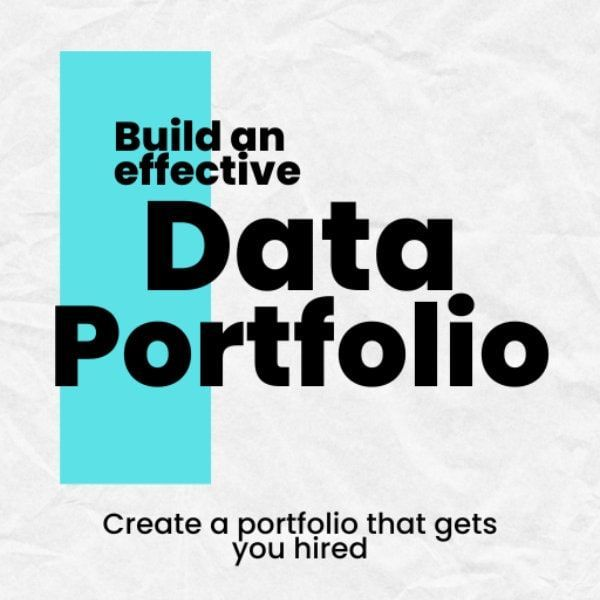

## **Day 30 → Building a Portfolio as a Data Analyst** 

This is the **final day**—where everything you’ve learned turns into **proof**. A portfolio shows *what you can do*, not just what you studied.



## **1️. What Is a Data Analyst Portfolio?**

A portfolio is a **collection of projects** that demonstrate:

* Data cleaning skills
* Analysis & insights
* Visualizations & dashboards
* Business thinking
* Communication (storytelling)

  **No certificates = still okay**
  **Projects > degrees**

## **2️. What Should Be in Your Portfolio? (Minimum)**

###  **3–5 Strong Projects**

Each project should include:

1. **Problem Statement**
2. **Dataset Source**
3. **Cleaning Steps**
4. **Analysis**
5. **Visualizations**
6. **Insights & Recommendations**

## **3️. Recommended Portfolio Projects (Beginner-Friendly)**

###   Project 1: Sales Performance Dashboard

**Skills:** Excel / Power BI

* Monthly sales trend
* Top products
* Best regions
* KPIs (Revenue, Profit)

###  Project 2: Customer Analysis

**Skills:** SQL + Visualization

* New vs returning customers
* Customer segments
* Revenue per customer

###  Project 3: Movie / Netflix Analysis

**Skills:** Python or Excel

* Genre popularity
* Ratings vs revenue
* Trends over years

### 🔹 Project 4 (Optional): A/B Testing Case

**Skills:** Statistics + storytelling

* Hypothesis
* Metrics
* Conclusion

---

## **4️⃣ How to Structure EACH Project (Very Important)**

Use this exact format 👇

### 📌 Project Title

**Example:** Sales Dashboard Analysis

### 📌 Objective

What business question are you answering?

### 📌 Dataset

* Source (Kaggle, public data)
* Number of rows & columns

### 📌 Tools Used

Excel | SQL | Python | Power BI

### 📌 Data Cleaning

* Removed duplicates
* Fixed dates
* Handled missing values

### 📌 Analysis & Visuals

* Charts
* Tables
* Dashboards

### 📌 Insights

* What did you discover?
* Why does it matter?

### 📌 Recommendation

* What should the business do next?

---

## **5️⃣ Where to Host Your Portfolio**

### 🥇 **GitHub (Must-Have)**

Your GitHub repo should include:

* `README.md`
* Dataset (or link)
* SQL / Python files
* Dashboard screenshots

📁 Example structure:

```
Sales-Dashboard-Project/
│── README.md
│── data/
│── sql_queries.sql
│── analysis.ipynb
│── dashboard.png
```

---

### 🥈 **LinkedIn**

* Add projects under **Experience**
* Post screenshots + insights
* Write short case studies

---

### 🥉 **Portfolio Website (Optional)**

Tools:

* GitHub Pages
* Notion
* Google Sites

---

## **6️⃣ Writing a STRONG README.md (Template)**

```md
# Sales Performance Dashboard

## Objective
Analyze sales data to identify trends and improve decision-making.

## Dataset
Kaggle Sales Dataset (50,000 rows)

## Tools
Excel, SQL, Power BI

## Cleaning
- Removed duplicates
- Standardized date formats
- Fixed missing values

## Key Insights
- Sales increased 18% YoY
- Top 3 products generate 60% revenue

## Recommendation
Focus marketing on high-performing products and regions.
```

---

## **7️⃣ Portfolio Checklist (Before Applying)** ✅

✔ At least 3 projects
✔ Clear problem statements
✔ Clean visuals
✔ Business insights
✔ GitHub README files
✔ No messy data files
✔ Simple explanations (non-technical)

---

## **8️⃣ Final Advice (Very Important)**

* **Quality > Quantity**
* One well-explained project beats five weak ones
* Recruiters spend **30–60 seconds** per portfolio
* Make insights **obvious and clear**

---

## 🎉 Congratulations!

You now know:

* Data cleaning
* Analysis
* Dashboards
* KPIs
* Storytelling
* A/B testing
* AND how to **show your skills publicly**

If you want, next we can:
✅ Build your **first real portfolio project step-by-step**
✅ Review your GitHub README
✅ Create a **Data Analyst resume**
✅ Prepare for **interview questions**

Just tell me your next move 🚀


