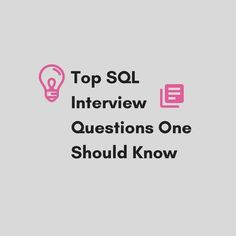

# **Day 33 → SQL Interview Questions (Beginner to Intermediate)**

SQL is one of the **most important skills** for a Data Analyst.
Almost every interview will test your SQL knowledge — either through questions, exercises, or live queries.

This article covers **common SQL interview questions**, from beginner to intermediate level, with **clear explanations** of what interviewers are really testing.

##  Why SQL Is So Important for Data Analysts

Companies store most of their data in **databases**.
SQL allows analysts to:

* Retrieve data
* Filter and clean data
* Aggregate metrics
* Join multiple tables
* Create reports and dashboards

If you know SQL well, you can answer business questions quickly.

##  Beginner-Level SQL Interview Questions

These test **basic understanding** and are very common for junior roles.

### **1️. What is SQL?**

**Answer:**
SQL (Structured Query Language) is a language used to **communicate with databases**.
It allows users to retrieve, insert, update, and delete data stored in tables.

**What interviewers check:**
Basic understanding and confidence.

### **2️. What is a database?**

**Answer:**
A database is an organized collection of data stored electronically, usually in tables with rows and columns.

### **3️. What is a table?**

**Answer:**
A table stores data in rows (records) and columns (fields).

Example:

| customer_id | name | country |
| ----------- | ---- | ------- |

### **4️. What is a primary key?**

**Answer:**
A primary key is a column that **uniquely identifies each row** in a table.

Examples:

* customer_id
* order_id

Rules:

* Must be unique
* Cannot be NULL

### **5️. What is the difference between WHERE and HAVING?**

**Answer:**

* **WHERE** filters rows *before* aggregation
* **HAVING** filters results *after* aggregation

Example:

* WHERE filters individual rows
* HAVING filters grouped results (after GROUP BY)

### **6️. What does SELECT * mean?**

**Answer:**
It selects **all columns** from a table.

  In real work, analysts avoid it and select only needed columns.

##  Intermediate-Level SQL Interview Questions

These test **real-world SQL skills**.

### **7️. What is GROUP BY used for?**

**Answer:**
GROUP BY groups rows with the same values and allows aggregate functions like:

* COUNT()
* SUM()
* AVG()
* MIN()
* MAX()

Example use cases:

* Total sales per product
* Customers per country

### **8️. What is a JOIN?**

**Answer:**
A JOIN combines rows from two or more tables based on a related column.

### **9️. Types of JOINs (Very Important)**

| JOIN Type  | Description                         |
| ---------- | ----------------------------------- |
| INNER JOIN | Only matching rows                  |
| LEFT JOIN  | All rows from left table + matches  |
| RIGHT JOIN | All rows from right table + matches |
| FULL JOIN  | All rows from both tables           |

Most interviews focus on **INNER JOIN** and **LEFT JOIN**.

### ** Common Interview Tip**

If you're unsure, **LEFT JOIN** is often safer because it keeps all records from the main table.

### **10. What is NULL?**

**Answer:**
NULL represents **missing or unknown data**.

Important:

* NULL ≠ 0
* NULL ≠ empty string

Special handling:

* Use `IS NULL` or `IS NOT NULL`

### **1️1️. What is a subquery?**

**Answer:**
A subquery is a query inside another query.

Used for:

* Filtering
* Calculations
* Comparing values

Subqueries appear in:

* SELECT
* WHERE
* FROM

### **1️2. Difference between WHERE and JOIN conditions**

**Answer:**

* JOIN conditions define how tables connect
* WHERE filters the final result

Good analysts know **when to filter**.

### **1️3️. What is DISTINCT?**

**Answer:**
DISTINCT removes duplicate values from query results.

Used to:

* Count unique users
* List unique countries
  
### **1️4️. What is an index?**

**Answer:**
An index improves **query performance** by speeding up data retrieval.

Trade-off:

* Faster SELECT
* Slower INSERT/UPDATE

Interviewers want to see you understand **performance basics**.

### **1️5️. What is the order of SQL execution? (Advanced but common)**

SQL runs in this order:

1. FROM
2. JOIN
3. WHERE
4. GROUP BY
5. HAVING
6. SELECT
7. ORDER BY
8. LIMIT

Knowing this helps debug queries.

##  Practical SQL Interview Scenarios

Interviewers often ask:

* Find top 5 customers by revenue
* Count users per month
* Identify duplicate records
* Join sales and customer tables
* Calculate average order value

They care more about **logic** than perfect syntax.

##  Common SQL Interview Mistakes

* Forgetting GROUP BY
* Misusing WHERE vs HAVING
* Not handling NULLs
* Wrong JOIN type
* Overcomplicated queries
* Poor explanation of logic

## How to Prepare for SQL Interviews

* Practice daily
* Explain queries out loud
* Focus on JOINs and GROUP BY
* Solve real problems (sales, customers, orders)
* Use platforms like LeetCode, HackerRank, SQLZoo
  
##  Final Takeaway

SQL interviews test:

* Your **thinking**
* Your **logic**
* Your **understanding of data**

You don’t need to memorize everything —
you need to **understand how data works**.

###  End of Day 33

 **Day 34 → Case Study: Sales Data Analysis (SQL + Insights)**

