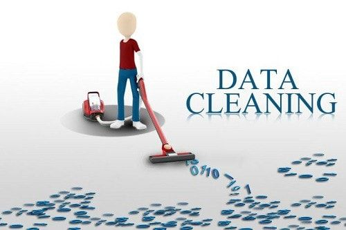

# Day 4 — Understanding Data Cleaning (The Most Important Skill!)

Data cleaning (also called **data preprocessing**) is the process of **fixing, correcting, and preparing data** so it becomes accurate and ready for analysis.

  **80% of a data analyst’s job is cleaning data.**
Because if your data is wrong → your conclusions will be wrong.

---

## Why Data Cleaning Matters

Raw data is usually messy.
It often contains:

* Missing values
* Incorrect spellings
* Duplicated rows
* Wrong data types
* Outliers
* Inconsistent categories
* Empty spaces
* Formatting issues

If you analyze dirty data, your results will be misleading.

Clean data = **trustworthy insights**.

---

## Common Data Cleaning Tasks

### **1. Remove Duplicates**

Example:

| Name  | Age |             |
| ----- | --- | ----------- |
| Ali   | 22  |             |
| Ali   | 22  | ← duplicate |
| Sarah | 25  |             |

Duplicate records make totals and averages incorrect.

---

### **2. Fix Missing Values**

Example:

| Product | Price   |
| ------- | ------- |
| Milk    | 2.5     |
| Bread   | *empty* |

Solutions include:

* Fill with average
* Fill with 0
* Remove the row
* Use business logic to estimate

---

### **3. Correct Data Types**

Example:

* “25” stored as text instead of number
* Dates stored as strings
* Prices stored as text with symbols (“$45”)

You must convert them to the right formats.

---

### **4. Standardize Categories**

Example:

| Country       |
| ------------- |
| USA           |
| U.S.A         |
| United States |
| Usa           |

All of these mean the same thing but appear different.
You standardize them into one consistent value.

---

### **5. Fix Formatting Issues**

Problems like:

* Extra spaces
* Lowercase vs uppercase
* Incorrect decimal places
* Commas vs dots

Example:

* `"  London "` → `"London"`
* `"john"` → `"John"`

---

### **6. Handle Outliers**

Outliers = extreme values that don’t make sense.

Example:
A customer age = **200**
That is not realistic → needs checking.

---

## Real-World Example: Sales Dataset

Raw data problems:

* Dates stored as “12-03-25” instead of real date format
* Some products spelled differently
* Some quantities negative
* Prices missing for some items
* Duplicate rows for the same transaction

After cleaning:

* All values are consistent
* No duplicates
* Dates are in correct format
* Prices fixed
* Ready for analysis

---

## 🛠 Tools for Data Cleaning

You will use:

* **Excel** → Remove duplicates, clean formatting
* **Power Query** → Automate cleaning
* **SQL** → Filter, fix values, correct types
* **Python (Pandas)** → Clean large datasets

---

## Summary

| Step                   | Meaning                         |
| ---------------------- | ------------------------------- |
| Remove duplicates      | Prevent double counting         |
| Handle missing values  | Fix incomplete data             |
| Correct data types     | Convert to the right format     |
| Standardize categories | Make values consistent          |
| Fix formatting         | Clean spaces, punctuation, text |
| Handle outliers        | Remove impossible values        |

Clean data is the foundation of all good analysis.

---

## End of Day 4

**Day 5 → Databases & SQL**
