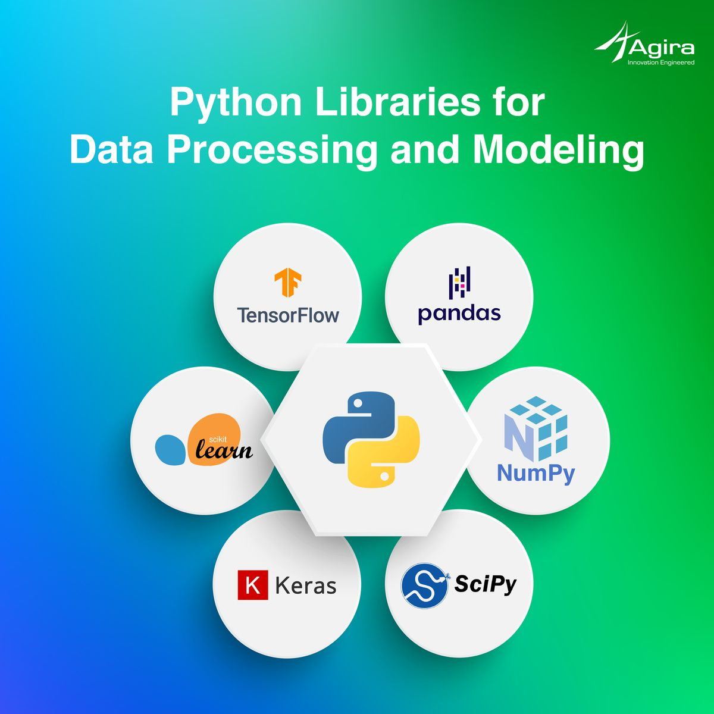

# Day 6 — Python for Data (Beginner Concepts)

Python is one of the **most popular tools** for data analysis.
It is simple, powerful, and used by data analysts, data scientists, and machine learning engineers.

Today we learn the basics — no coding experience needed.

---


# What Is Python?

Python is a **programming language** used for:

* Data analysis
* Data cleaning
* Automation
* Machine learning
* Web scraping
* Building dashboards
* Creating reports

It is beginner-friendly because the code looks almost like English.

Example:

```python
print("Hello, world!")
```

---

# Why Python Is Important for Data

Python allows you to:

* Clean messy datasets
* Analyze large amounts of data
* Build visualizations
* Automate tasks
* Work with machine learning models

It becomes more useful than Excel when:

* The dataset is very large
* You need to automate repetitive work
* You need advanced analysis

---

# Important Python Libraries for Data

Libraries = tools that make Python powerful.

### **1. Pandas**

Used for:

* Data cleaning
* Data analysis
* Reading Excel/CSV files

Pandas is the "Excel" of Python.

Example:

```python
import pandas as pd
```

---

### **2. NumPy**

Used for:

* Math
* Calculations
* Working with arrays

---

### **3. Matplotlib / Seaborn**

Used for:

* Creating charts
* Visualizing trends

---

### **4. Scikit-Learn**

Used for:

* Machine learning
* Predictions
* Models

---

# Example: Reading a CSV File in Python

A simple real-world example:

```python
import pandas as pd

data = pd.read_csv("sales.csv")
print(data.head())
```

This code:

* Imports pandas
* Loads a dataset
* Shows the first 5 rows

---

# Example: Cleaning Data in Python

```python
df = pd.read_csv("sales.csv")

df.drop_duplicates(inplace=True)
df.fillna(0, inplace=True)
df["Date"] = pd.to_datetime(df["Date"])
```

This cleans the data by:

* Removing duplicates
* Filling missing values
* Fixing date formats

---

# Python vs Excel (Beginner-Level Comparison)

| Task              | Excel     | Python       |
| ----------------- | --------- | ------------ |
| Manual tasks      | Slow      | Can automate |
| Large datasets    | Gets slow | Fast         |
| Reproducibility   | Hard      | Easy         |
| Advanced analysis | Limited   | Powerful     |
| Visualization     | Good      | Excellent    |

Both are useful, but Python is best for **big data and automation**.

---

# What You Will Learn Later (Not Today)

As you continue your data journey, you will learn:

* DataFrames
* Loops & functions
* Merging datasets
* Grouping & aggregating
* Visualizing data
* Using APIs
* Machine learning basics

Today is only the foundation.

---

# Summary

| Concept      | Meaning                         |
| ------------ | ------------------------------- |
| Python       | Powerful language for data      |
| Pandas       | Tool for data cleaning/analysis |
| NumPy        | Tool for calculations           |
| Matplotlib   | Tool for charts                 |
| Scikit-Learn | Tool for machine learning       |
| CSV          | Common file format for datasets |

Python is simple to start and extremely powerful for data work.

---

## End of Day 6

**Day 7 → Dashboards & Data Visualization**
