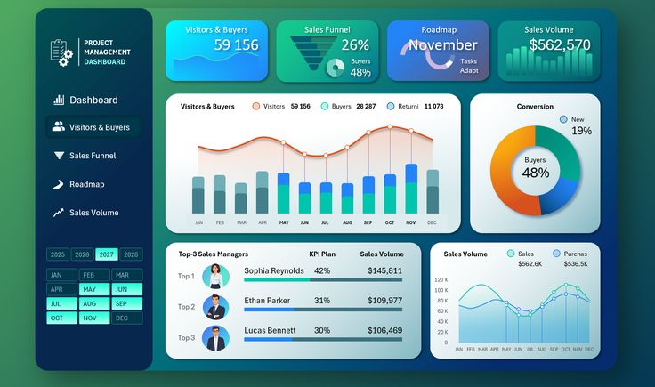

# Day 7 — Dashboards & Data Visualization 

Data visualization is the process of **turning numbers into charts, graphs, and visual stories**.
Dashboards are **interactive pages** that show multiple visualizations in one place.

Visualization helps people understand information quickly — even without reading a long report.

---

# What Is Data Visualization?

Data visualization means presenting data using:

* Bar charts
* Line charts
* Pie charts
* Maps
* Tables
* KPIs (Key Performance Indicators)

It answers questions like:

* Are sales increasing or decreasing?
* Which product performs best?
* Which month has the highest revenue?

Humans understand visuals faster than text.

---

# What Is a Dashboard?

A **dashboard** is a collection of charts and metrics displayed on one screen.

It helps decision-makers see:

* Trends
* Problems
* Opportunities
* Overall performance

Good dashboards are simple, clean, and focused.

---

# 🛠 Tools Used for Dashboards

The most common tools:

### **1. Power BI**

* Easy to use
* Great visuals
* Connects to many data sources

### **2. Tableau**

* Very powerful
* Used by many large companies

### **3. Google Looker Studio**

* Free
* Easy for beginners

### **4. Excel**

* Can create dashboards using charts, pivot tables, slicers

---

# Common Dashboard Visuals

### **1. Bar Chart**

Compare categories
Example: Sales by product

### **2. Line Chart**

Show trends over time
Example: Monthly sales

### **3. Pie/Donut Chart**

Show parts of a whole
Example: Market share

### **4. Table**

Show detailed information
Example: Customer list

### **5. KPI Cards**

Show important numbers
Example:

* Total Sales
* Total Customers
* Profit

---

# What Makes a Good Dashboard?

A good dashboard should be:

* **Clear** — no confusion
* **Simple** — no unnecessary charts
* **Accurate** — based on clean data
* **Interactive** — slicers/filters
* **Fast** — loads quickly

Avoid adding too many colors or too many elements.

---

# Real Example: Sales Dashboard (Simple Logic)

A supermarket dashboard may include:

* Total sales
* Top 5 products
* Sales by branch
* Sales by month
* A line chart showing growth
* A bar chart comparing store performance

This helps the company answer:

* Which branch is performing well?
* Which products to restock?
* Which months need promotions?

---

# How Data Visualization Helps Companies

Visualization helps companies:

* Understand customer behavior
* Track performance
* Identify problems quickly
* Make better decisions
* Communicate insights clearly

It's one of the most important skills in data analysis.

---

# Summary

| Concept            | Meaning                             |
| ------------------ | ----------------------------------- |
| Visualization      | Turning data into charts            |
| Dashboard          | Page with multiple visuals          |
| Power BI / Tableau | Tools for dashboards                |
| Good dashboard     | Clear, simple, interactive          |
| Purpose            | Help people understand data quickly |

Visualization is where your hard work becomes easy to understand.

---

## End of Day 7

**Day 8 → Business Intelligence**

