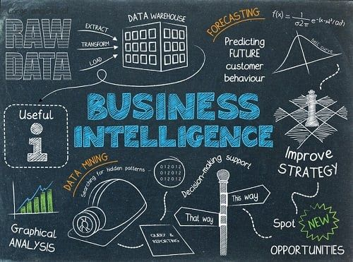

# Day 8 — Business Intelligence (Beginner-Friendly)

**Business Intelligence (BI)** is the process of using data to help businesses make better decisions.
It combines **data, tools, dashboards, and reports** to answer important business questions.

Think of BI as the **bridge between data and business decisions**.

# What Is Business Intelligence?

Business Intelligence helps companies:

* Understand performance
* Identify problems early
* Find opportunities
* Improve decision-making
* Track goals
* Reduce costs
* Increase profits

It turns raw data → insights → actions.

# What BI Includes

Business Intelligence is made up of 4 key parts:

### **1. Data Collection**

Collecting data from:

* Excel files
* Databases
* Websites
* Applications
* Sales systems
* Finance systems

### **2. Data Cleaning & Transformation**

Using tools like Power Query, SQL, or Python to clean and prepare data.

### **3. Data Analysis**

Finding patterns:

* Sales increasing or decreasing?
* Which products are doing best?
* Which branch is underperforming?

### **4. Dashboards & Reporting**

Using tools like:

* Power BI
* Tableau
* Looker Studio
* Excel

This is where companies visualize their data.

# What BI Teams Do in Companies

A BI team (or BI analyst) works on:

* Building dashboards
* Creating automated reports
* Monitoring KPIs
* Connecting data sources
* Ensuring data accuracy
* Explaining insights to management
* Supporting marketing, finance, and operations teams

BI helps every part of the business.

# KPIs (Key Performance Indicators)

KPIs are **important numbers** companies track.

Examples:

* Total sales
* Profit
* Customer retention
* Website visits
* Delivery time
* Inventory levels

Dashboards usually show KPIs at the top.

# Common BI Tools

### **1. Power BI**

Most popular for interactive dashboards.

### **2. Tableau**

Strong visual capabilities.

### **3. Looker Studio**

Simple and free.

### **4. SQL**

Used to pull and prepare data.

### **5. Excel**

Still used for analysis and reporting.

# Real Example: Supermarket BI System

A supermarket may track:

* Daily sales
* Profit by category
* Top-selling products
* Branch performance
* Customer spending behavior

BI helps answer:

* Which products need restocking?
* Which branches are losing money?
* What day of the week sells the most?
* Which promotions work?

This helps the supermarket plan better and grow.

# Why BI Is Important for Data Analysts

As a future data analyst, BI will help you:

* Build dashboards
* Automate reporting
* Understand business needs
* Communicate insights clearly

BI is where technical skills meet business understanding.

# Summary

| Concept         | Meaning                             |
| --------------- | ----------------------------------- |
| BI              | Turning data into business insights |
| Data collection | Getting data from different sources |
| Transformation  | Cleaning and preparing data         |
| Dashboards      | Visualizing key metrics             |
| KPIs            | Important business numbers          |

Business Intelligence = Better decisions through data.

## End of Day 8

**Day 9 → Real-World Data Stories**

